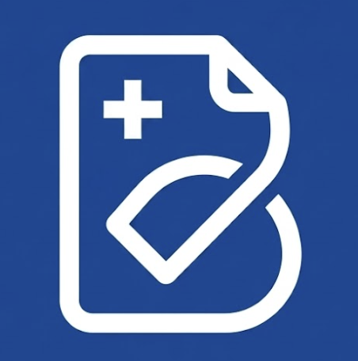
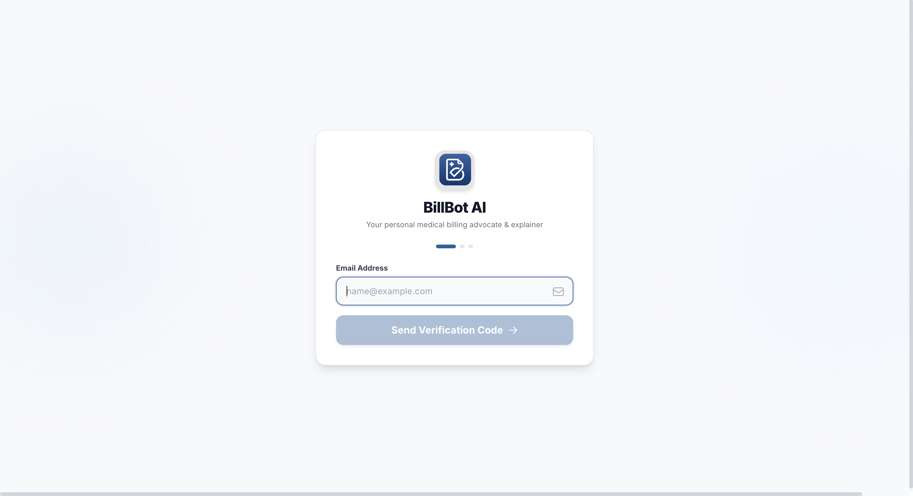
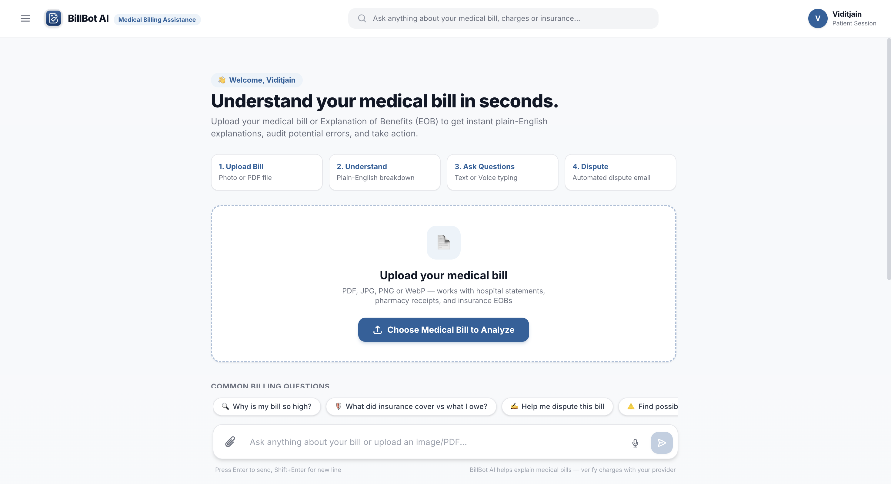
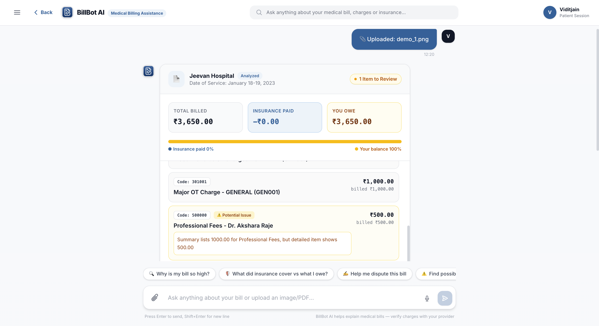
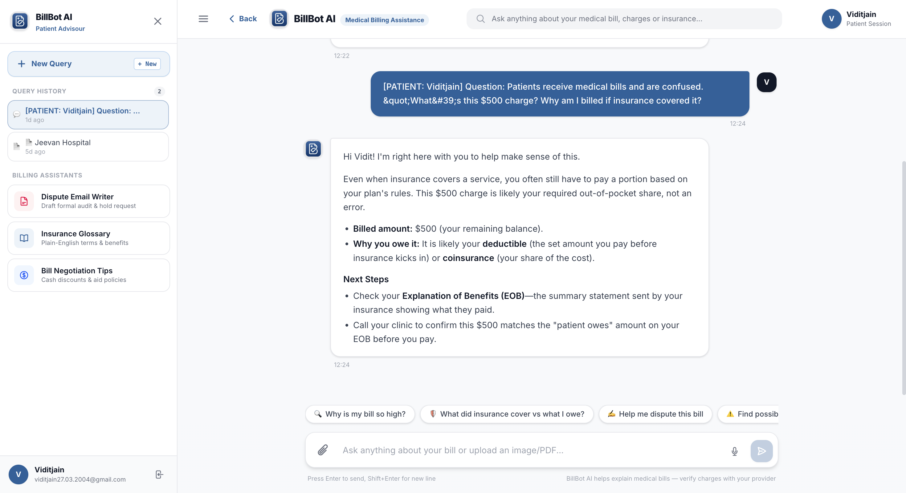

<div align="center">



# BillBot AI

### Your medical bill, explained in plain English — in seconds.

BillBot AI reads confusing hospital bills and insurance EOBs, flags possible errors,
and tells you exactly what you owe and why — powered end-to-end by Google Gemini.

<p>
  
  
  
  
  
  
  
</p>

<p>
  
  
  
</p>

<p>
  <a href="#-features"></a>
  <a href="#️-tech-stack"></a>
  <a href="#-screenshots"></a>
  <a href="#-getting-started"></a>
  <a href="#-architecture"></a>
  <a href="#-project-structure"></a>
  <a href="#️-roadmap"></a>
  <a href="#-authors"></a>
</p>

</div>

---

## 💡 The Problem

Patients routinely receive medical bills and insurance EOBs full of cryptic CPT/HCPCS
codes, unexplained balances, and surprise out-of-network charges. Most people can't
tell what they're being charged for, whether it's correct, or who to even call about
it — so they either overpay or give up and call the billing office, over and over.

## ✨ Features

| | Feature | Description |
|---|---|---|
| 📄 | **Multimodal Bill & EOB Parsing** | Upload a bill or EOB as PDF, PNG, JPEG, or WebP — Gemini reads it directly, no OCR pipeline needed. |
| 💬 | **Plain-English Explanations** | Confusing codes and terms (CPT, HCPCS, deductible, coinsurance) translated to simple, 8th-grade-level language. |
| 🚩 | **Automatic Error Detection** | Flags potential billing errors, No Surprises Act violations, duplicate charges, and unbundled fees. |
| ✉️ | **Dispute Letter Generator** | Drafts a ready-to-send, fully-written formal dispute email — no placeholder brackets. |
| 🎙️ | **Voice Input** | Ask questions hands-free with built-in speech-to-text. |
| 💾 | **Persistent Chat History** | SQLite-backed sessions with auto-titling, resuming, and deletion. |
| 🔐 | **Passwordless Auth** | Email + OTP sign-in — zero passwords ever touch the database. |
| ⚡ | **Real-Time Streaming** | Responses stream token-by-token for a natural, live conversational feel. |
| 📱 | **Responsive / PWA-ready** | One codebase, works on desktop and mobile browsers alike. |

## 🛠️ Tech Stack

| Layer | Tool / Tech |
|---|---|
| **Frontend Framework** | Next.js 16 (App Router) |
| **UI Library** | React 19 |
| **Language** | TypeScript 5 |
| **Styling** | Tailwind CSS 4 |
| **AI Model** | Google Gemini API — **`gemini-3.6-flash`** (multimodal, streaming) |
| **AI SDK** | `@google/genai` |
| **Database** | `better-sqlite3` (local, lightweight persistence) |
| **Auth** | Passwordless Email + OTP |
| **Deployment** | Vercel |
| **Vibe Coding / AI Build Tool** | **Antigravity** |

## 🖼️ Screenshots

<div align="center">

**Passwordless Sign-In**



**Landing - Upload & Quick Questions**



**Bill Analysis - Itemized Breakdown & Flags**



**Chat History & Conversational Follow-ups**



</div>

## 🏗️ Architecture

```
┌─────────────────────┐        ┌──────────────────────────┐        ┌───────────────────┐
│   Next.js Frontend   │──────▶│   Next.js API Routes      │──────▶│   Google Gemini    │
│  (React 19, Tailwind)│        │  /api/chat  /api/parse-bill│       │  3.6 Flash (multimodal)│
│  Chat UI, Upload,     │◀──────│  /api/auth  /api/sessions │◀──────│  streamed responses │
│  Bill Summary Cards   │        │  (server-side API key)    │        └───────────────────┘
└─────────────────────┘        └──────────────────────────┘
           │                                │
           ▼                                ▼
   localStorage (session token)     better-sqlite3 (chat/session history)
```

The Gemini API key **never** reaches the browser — every model call is proxied through
a Next.js API route on the server.

## 🚀 Getting Started

### Prerequisites
- [Node.js](https://nodejs.org/) 18.18+ (Next.js 16 requirement)
- A free [Google Gemini API key](https://aistudio.google.com/apikey)

### 1. Clone the repository
```bash
git clone https://github.com/viditjain27/BillBot.AI.git
cd BillBot.AI
```

### 2. Install dependencies
```bash
npm install
```

### 3. Configure environment variables
```bash
cp .env.example .env.local
```
Then add your key to `.env.local`:
```env
GEMINI_API_KEY=your_gemini_api_key_here
```

### 4. Run the development server
```bash
npm run dev
```
Open **[http://localhost:3000](http://localhost:3000)** in your browser. 🎉

> **No Gemini key yet?** The app automatically falls back to realistic simulated
> responses so you can demo the full UI/UX without one.

## 📁 Project Structure

```
BillBot.AI/
├── app/
│   ├── api/
│   │   ├── auth/            # OTP generation & verification
│   │   ├── chat/             # Streaming chat endpoint
│   │   ├── parse-bill/       # Multimodal bill/EOB parser
│   │   └── sessions/         # Session CRUD & message history
│   ├── globals.css
│   ├── layout.tsx
│   └── page.tsx              # App shell & state orchestrator
├── components/
│   ├── AuthModal.tsx         # Email + OTP auth flow
│   ├── BillSummaryCard.tsx   # Structured bill breakdown card
│   ├── ChatWindow.tsx        # Messages, input bar, upload, voice
│   ├── DisputeLetterModal.tsx
│   ├── LoginPage.tsx
│   ├── MessageBubble.tsx
│   ├── QuickReplyChips.tsx
│   ├── Sidebar.tsx
│   └── UploadButton.tsx
├── lib/
│   ├── db.ts                 # SQLite schema & helpers
│   ├── gemini.ts              # Gemini SDK integration + streaming
│   └── prompts.ts             # System prompts
├── screenshots/               # README screenshots (see below)
└── public/
```

## 🔒 Security & Privacy

- Passwordless email + OTP auth — **no passwords are ever stored.**
- `.env*` files and local database files (`data/*.db`) are excluded via `.gitignore`.
- All Gemini calls happen server-side; the API key never reaches the client.
- Uploaded bills are processed for the active session and not shared with third parties.

## 🗺️ Roadmap

- [ ] Google OAuth as an alternative sign-in option
- [ ] Optional encrypted, opt-in cloud storage for saved bills
- [ ] Multi-language plain-English explanations
- [ ] Native app packaging (Capacitor)


## 📜 License

Distributed under the **MIT License**. See `LICENSE` for details.

---

## 👥 Authors

<div align="center">

<table>
  <tr>
    <td align="center">
      <b>Vidit Jain</b><br/><br/>
      <a href="https://www.linkedin.com/in/viditjain2704/">
        
      </a>
      <br/>
      <a href="mailto:vidit0027@gmail.com">
        
      </a>
    </td>
    <td align="center">
      <b>Jahnavi Vaddi</b><br/><br/>
      
    </td>
    <td align="center">
      <b>Anushka Singh</b><br/><br/>
      
    </td>
  </tr>
</table>

</div>

<div align="center">
<sub>Built with ☕, 🤖 Gemini, and way too many browser tabs about CPT codes.</sub>
</div>
